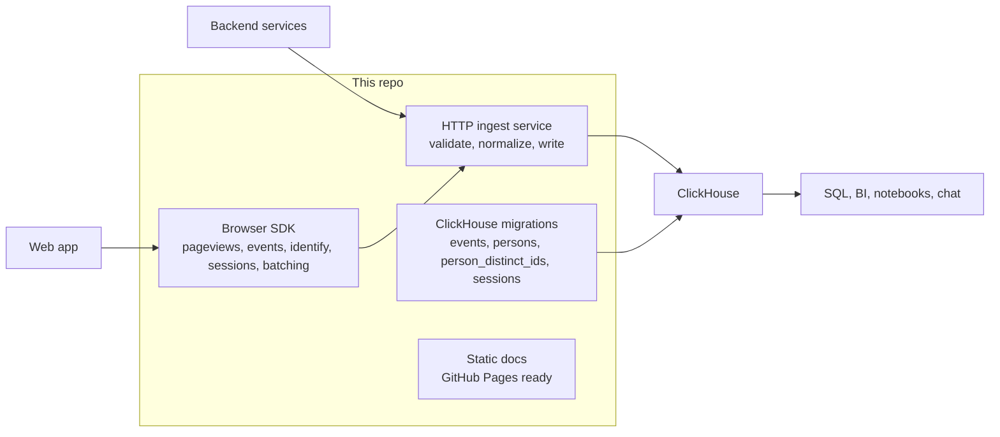

# ClickHouse Product Analytics

> [!NOTE]
> This is a personal side project. I work on it when I have spare weekend time, so progress will be incremental.

ClickHouse Product Analytics is a first-party product analytics ingress layer for ClickHouse. It captures browser and backend product events, validates and normalizes them through a single HTTP service, and writes them into ClickHouse tables that are ready for SQL, BI, and conversational analysis.

The repo scope is intentionally narrow: own the first mile of product analytics and leave visualization to the tools that already sit on top of ClickHouse.

## What Is Included

- **Browser SDK** (`packages/sdk`): client-side initialization, pageviews, custom events, identify/reset, sessions, batching, retry, unload flushing, privacy-aware optional autocapture, and opt-in/out helpers.
- **React bindings** (`packages/react`): provider, hook, and viewport tracking component for React and Next.js apps.
- **HTTP ingest service** (`packages/ingest-service`): origin and API-key validation, CORS/origin allowlisting, compressed request handling, event normalization, person linking, and ClickHouse writes.
- **ClickHouse migrations** (`packages/ingest-service/migrations`): `events`, `persons`, and `person_distinct_ids` tables plus the `sessions` view.
- **Local stack** (`docker-compose.yml`): ClickHouse plus ingest service with migration-on-start for development.
- **Examples** (`examples`): a Next.js browser smoke app and direct backend API capture script.
- **Docs**: static docs site, generated reference pages, and the committed OpenAPI spec.
- **Attribution** (`ATTRIBUTION.md`, `THIRD_PARTY_NOTICES.md`): upstream inspiration and license notes.

## Quick Start

```bash
cp .env.example .env
npm install
npm run build:packages
docker compose up -d --build
npm run verify:e2e
```

The local stack exposes:

- Ingest service: `http://127.0.0.1:8080`
- ClickHouse HTTP API: `http://127.0.0.1:8123`
- Development backend API key: `local_dev_key`

The Compose stack pins `clickhouse/clickhouse-server:26.3.9.8-alpine` so local development and E2E verification use the current 26.3 stable ClickHouse release without depending on a floating image tag. If you need registry-level reproducibility, pin the same image by digest in your own deployment.

## Documentation

See the [deployed documentation site](https://marcklingen.github.io/clickhouse-product-analytics/) for setup, SDK usage, API reference, deployment, and operations.

## Browser SDK

```ts
import analytics from '@clickhouse-product-analytics/sdk'

analytics.init({
  apiHost: 'http://127.0.0.1:8080',
  capturePageview: 'history_change',
  autocapture: {
    captureText: true,
    elementAllowlist: ['button', 'a']
  },
  propertyDenylist: ['secret']
})

analytics.capture('signup_started', { plan: 'pro' })
analytics.identify('user_123', { email: 'user@example.com' })
await analytics.flush()
```

Useful SDK options:

- `apiHost`: ingest service URL.
- `capturePageview`: `true`, `false`, or `"history_change"` for browser apps with client-side routing.
- `capturePageleave`: `true`, `false`, or `"if_capture_pageview"`.
- `autocapture`: disabled by default; pass an object to capture safe click/change/submit events with allowlists.
- `persistence`: `localStorage+cookie`, `localStorage`, or `memory`.
- `requestBatching`, `flushAt`, `flushIntervalMs`: batching controls.
- `beforeSend`: mutate or drop events before they enter the queue.
- `propertyDenylist`: remove properties before sending.

## React

Use the React package when you want initialization at the app root and a hook inside components.

```tsx
'use client'

import { AnalyticsProvider, useAnalytics } from '@clickhouse-product-analytics/react'

export function Providers({ children }: { children: React.ReactNode }) {
  return (
    <AnalyticsProvider
      options={{
        apiHost: 'http://127.0.0.1:8080',
        capturePageview: 'history_change',
        persistence: 'localStorage+cookie'
      }}
    >
      {children}
    </AnalyticsProvider>
  )
}

export function SignupButton() {
  const analytics = useAnalytics()

  return (
    <button onClick={() => analytics?.capture('signup_clicked')}>
      Sign up
    </button>
  )
}
```

For Next.js App Router, put the provider in a small client component such as `app/providers.tsx`, then wrap `{children}` from `app/layout.tsx`. The provider initializes only in the browser, returns `undefined` from `useAnalytics()` until ready, and keeps children rendering if analytics is not initialized yet.

For the full React setup, including viewport tracking caveats, see the deployed docs.

## Direct API

Single-event ingestion uses the same batch envelope with one event:

```bash
curl -X POST http://127.0.0.1:8080/batch/ \
  -H 'content-type: application/json' \
  -d '{
    "api_key": "local_dev_key",
    "batch": [
      {
        "event": "backend_job_completed",
        "distinct_id": "user_123",
        "properties": {
          "job_id": "job_456",
          "duration_ms": 481
        }
      }
    ]
  }'
```

Batch:

```json
{
  "api_key": "local_dev_key",
  "batch": [
    {
      "event": "$pageview",
      "distinct_id": "anon_123",
      "properties": {
        "$current_url": "https://example.com/",
        "$session_id": "session_123"
      }
    }
  ]
}
```

Identity events use `$identify` with `$anon_distinct_id`, `$set`, and `$set_once`. The service links anonymous and known IDs through `person_distinct_ids` and writes person properties into `persons`.

## Ingest Service Configuration

Environment variables:

- `PORT`: HTTP port, default `8080`.
- `LOG_LEVEL`: service log level, default `warn`.
- `PUBLIC_API_KEYS`: optional comma-separated API keys. No-origin backend requests require one of these keys; leave empty to disable no-origin backend ingest. Browser requests from `ALLOWED_ORIGINS` can omit `api_key`; if they provide one, it must match this list. Keep old and new keys in the list during rotation.
- `ALLOWED_ORIGINS`: comma-separated browser origins allowed by CORS and source validation.
- `ALLOWED_HOSTS`: optional explicit host allowlist for accepting requests across schemes on those hosts.
- `MAX_BATCH_BYTES`: request body limit, default 20 MB.
- `MAX_EVENTS_PER_BATCH`: event count limit, default 10,000.
- `CLICKHOUSE_URL`, `CLICKHOUSE_USER`, `CLICKHOUSE_PASSWORD`, `CLICKHOUSE_DATABASE`: ClickHouse connection.
- `MIGRATE_ON_START`: set to `true` for development containers; run migrations manually in production.

## Development

```bash
npm run verify
docker compose up -d --build
npm run verify:e2e
npm run dev:next
```

The E2E verifier builds the Next.js smoke app, exercises the documented browser SDK, React, direct API, identity, CORS, gzip, pageview/pageleave, autocapture, and docs deployment wiring flows, then queries ClickHouse for matching `events`, `persons`, `person_distinct_ids`, and `sessions` rows.

Use `npm run release:dry-run` before publishing the SDK and React packages.

## Attribution

This project is independent. See [`ATTRIBUTION.md`](./ATTRIBUTION.md) and [`THIRD_PARTY_NOTICES.md`](./THIRD_PARTY_NOTICES.md) for attribution and license details.

## Architecture



## Starter Queries

```sql
SELECT
    toDate(timestamp) AS day,
    count() AS events,
    uniqExact(person_id) AS people
FROM product_analytics.events
GROUP BY day
ORDER BY day;
```

```sql
SELECT
    event,
    count() AS count
FROM product_analytics.events
WHERE timestamp >= now() - INTERVAL 7 DAY
GROUP BY event
ORDER BY count DESC;
```

```sql
SELECT
    person_id,
    min(timestamp) AS first_seen,
    max(timestamp) AS last_seen,
    countIf(event = '$pageview') AS pageviews,
    count() AS total_events
FROM product_analytics.events
GROUP BY person_id
ORDER BY last_seen DESC
LIMIT 50;
```
