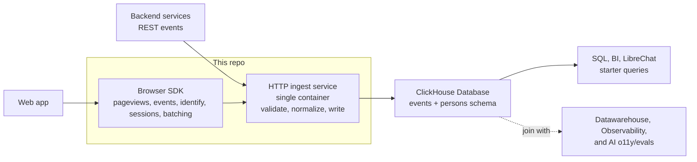

# ClickHouse Product Analytics

> [!NOTE]
> This is a personal side project. I'll work on it when I have spare time, so progress will be slow.

ClickHouse Product Analytics is a first-party product analytics ingress layer for ClickHouse. It helps teams send browser, clickstream, and product events directly into ClickHouse through a lightweight browser SDK and HTTP ingest service.

The repo scope is intentionally limited to the first mile of product analytics: event capture in the browser and reliable ingestion into ClickHouse. It is not intended to define a full analytics suite in v1; dashboards, feature flags, experiments, session replay, surveys, heatmaps, and other heavyweight product analytics features are out of scope.

## Why Build This

Many teams use a product analytics vendor mainly to capture events, store them in the vendor's managed backend, and then re-export the same data through S3 into their own DWH. That adds cost, latency, operational complexity, and another system of record for data that ultimately should be in the DWH anyway.

I use ClickHouse, thus I build this for ClickHouse. This could be extended to work with other OLAP DBs in the future.

## Modules

- **Browser SDK**: captures pageviews, custom events, identification, session state, and client-side batches.
- **HTTP ingest service**: accepts browser and backend events, validates requests, normalizes payloads, and writes to ClickHouse.

## Planned Architecture

## TODO

- [ ] Design the event payload contract for pageviews, custom events, identify calls, sessions, and backend REST events.
- [ ] Create the ClickHouse `events` and `persons` schema plus migration scripts.
- [ ] Implement the browser SDK: initialization, pageview capture, custom event capture, identify, session persistence, batching, flush, and retries.
- [ ] Implement the HTTP ingest service: service key auth, CORS and host allowlisting, payload validation, normalization, and ClickHouse writes.
- [ ] Add a local development setup with ClickHouse and the ingest service.
- [ ] Add example integrations for a browser app and backend REST capture.
- [ ] Add tests for SDK behavior, ingest validation, and ClickHouse writes.
- [ ] Add deployment docs for Docker, environment variables, and a basic self-hosted setup.
- [ ] Add starter queries for common product analytics questions.
- [ ] Add getting-started to docs
