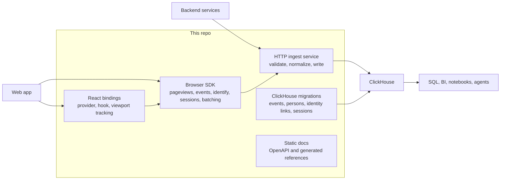

ClickHouse Product Analytics is a first-party product analytics ingress layer for ClickHouse. It captures browser and backend product events, validates and normalizes them through one HTTP service, and writes query-ready events, people, identity links, and sessions into ClickHouse.

The project intentionally owns only the first mile of product analytics: event capture, identity stitching, and warehouse-native storage. It does not include dashboards, funnels, feature flags, session replay, surveys, or a settings UI. Use ClickHouse, SQL, notebooks, BI tools, or agentic analytics on top of the tables.

## Why Build This

If your analytics events already need to end up in ClickHouse, a traditional product analytics pipeline can become a detour: send events to a vendor, let the vendor store them in its managed backend, then export them back through S3 into your own ClickHouse warehouse.

This project removes that loop. It gives you the first-party capture layer and ingest service needed to send product events directly into ClickHouse, while leaving analysis and visualization to the SQL, BI, notebook, and agentic tools you already use on top of the warehouse.

## Architecture



## Start

- [Sending events](/start/sending-events): browser SDK, backend/direct API, batch API, gzip, and event naming examples.
- [Identifying users](/start/identifying-users): anonymous IDs, `identify`, `$set`, `$set_once`, aliases, reset, and query implications.
- [React usage](/start/react): provider, hook, and viewport tracking setup for React and Next.js.

## Operate

- [Architecture](/operate/architecture): system boundaries, event flow, identity flow, and how the pieces fit together.
- [ClickHouse schema](/operate/clickhouse-schema): table/view schemas, JSON property access, and query patterns for humans and agents.

## Deployment

- [Docker Compose](/deployment/docker-compose): local stack, ClickHouse Cloud connection details, production container model, environment variables, and migration workflow.
- [Helm deployment](/deployment/helm): Kubernetes chart, autoscaling defaults, and install examples.
- [Railway deployment](/deployment/railway): Railway container setup with ClickHouse or ClickHouse Cloud.

## Reference

- [API reference](/reference/api): rendered OpenAPI reference for ingest endpoints.
- [OpenAPI spec](/reference/openapi): downloadable machine-readable API contract.
- [SDK reference](/reference/sdk): generated browser SDK reference.
- [React reference](/reference/react): generated React package reference.

## Project

- [Verification](/project/verification): what `npm run verify` and `npm run verify:e2e` prove.
- [Publishing packages](/project/publishing): npm package dry-runs, Release It, and explicit publish commands.
- [Coding agent skill](/project/agent-skill): repo-local skill for adding product analytics tracking with a coding agent.

## Quick Start

```bash
cp .env.example .env
npm install
npm run build:packages
docker compose up -d --build
npm run verify:e2e
```

Local endpoints:

- Ingest service: `http://127.0.0.1:8080`
- ClickHouse HTTP API: `http://127.0.0.1:8123`
- Development backend API key: `local_dev_key`

## Minimal Browser Example

```ts
import analytics from '@clickhouse-product-analytics/sdk'

analytics.init({
  apiHost: 'http://127.0.0.1:8080',
  capturePageview: 'history_change',
  autocapture: {
    captureText: true,
    elementAllowlist: ['button', 'a']
  },
  propertyDenylist: ['secret']
})

analytics.capture('signup_started', { plan: 'pro' })
analytics.identify('user_123', { email: 'user@example.com' })
await analytics.flush()
```

## Minimal Backend Example

```bash
curl -X POST http://127.0.0.1:8080/batch/ \
  -H 'content-type: application/json' \
  -d '{
    "api_key": "local_dev_key",
    "batch": [
      {
        "event": "backend_job_completed",
        "distinct_id": "user_123",
        "properties": {
          "job_id": "job_456",
          "duration_ms": 481
        }
      }
    ]
  }'
```

## Scope

This repository contains:

- `packages/sdk`: browser event capture, sessions, batching, pageview/pageleave, autocapture, persistence, opt-in/out, and identity helpers.
- `packages/react`: provider, hook, and viewport tracking component for React and Next.js applications.
- `packages/ingest-service`: Fastify ingest API, origin and API-key validation, decompression, normalization, identity side effects, and ClickHouse writes.
- `packages/ingest-service/migrations`: ClickHouse schema for `events`, `persons`, `person_distinct_ids`, and `sessions`.
- `examples`: a Next.js browser smoke app and a direct backend capture script.
- `docs`: this GitHub Pages documentation site, maintained as Markdown.
