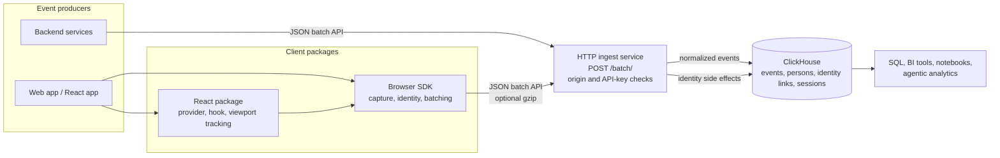

# Architecture

ClickHouse Product Analytics is deliberately small. The browser SDK and direct API collect events, the ingest service validates and normalizes them, and ClickHouse stores the resulting analytics tables. Everything else, including visualization and analysis, happens outside this repository.

## System Boundary

The ingest service has no settings UI and no runtime project model. Configuration comes from environment variables. Browser traffic is gated by allowed origins. `PUBLIC_API_KEYS` is optional to configure; when configured, keys are required for backend or no-origin requests and optional for allowed-origin browser requests. API keys are not tenant or identity boundaries.

## Components

### Browser SDK

The SDK runs in the browser and owns client-side capture behavior:

- anonymous device and distinct IDs
- local session/window IDs
- custom events
- initial and SPA-route pageviews
- pageleave/unload flushing
- optional autocapture for safe click/change/submit events
- batching, retries, and queue limits
- opt-in/out capture state
- `identify`, `alias`, `reset`, `$set`, and `$set_once`

The SDK always sends batched payloads to `/batch/`.

### React Package

The React package wraps the SDK for client-rendered React and Next.js applications:

- `AnalyticsProvider` initializes the SDK in a browser effect.
- `useAnalytics()` returns the initialized client when ready and `undefined` before initialization.
- `AnalyticsCaptureOnViewed` captures visibility events through `IntersectionObserver` when available, and falls back to immediate capture when it is not.

### HTTP Ingest Service

The ingest service is a stateless Fastify service. It accepts SDK and direct API traffic at `POST /batch/`, enforces source validation, normalizes event shape, applies identity side effects, and writes to ClickHouse.

### ClickHouse

ClickHouse is the only required database. The service writes append-only events and versioned identity/person rows. Query consumers should treat ClickHouse as the source of truth for product analytics.

## Event Flow

1. A browser or backend sends a JSON batch payload with one or more events. A one-event batch is the single-event ingestion path.
2. The service validates the request source: browser requests must match the origin allowlist, while no-origin backend requests need a configured API key.
3. The payload is decoded. Plain JSON request bodies and `Content-Encoding: gzip` request bodies are supported.
4. Invalid events inside a batch are dropped when the event name or distinct ID is missing. The response remains successful and includes a `dropped` count.
5. Each accepted event is normalized with promoted fields such as `event`, `distinct_id`, `person_id`, `session_id`, `window_id`, `current_url`, `host`, timestamp, IP, and user agent.
6. The event distinct ID is recorded in `person_distinct_ids`; identity events also update `persons` and link anonymous or alias IDs.
7. Events are inserted into the `events` table.
8. The `sessions` view aggregates session-level facts from `events`.

## Identity Flow

Before login, the browser SDK uses an anonymous distinct ID stored through the configured persistence layer. On login or signup, call `identify(userId, properties, setOnceProperties)`. The SDK emits a `$identify` event with the new distinct ID and the previous anonymous ID in `$anon_distinct_id`.

The ingest service writes identity links so both IDs point at the same `person_id`. Future events for either ID resolve to that person. Person profile updates are stored in `persons`; `$set` overwrites properties and `$set_once` only fills missing properties.

## Failure Model

The browser SDK queues events and retries transient send failures. During unload/pagehide it uses `sendBeacon` when requested and falls back to `fetch` when the browser rejects the beacon.

The ingest service has no local runtime state. Horizontal event capture is safe as long as every instance points at the same ClickHouse database and uses the same environment configuration. There is no separate queue, cache, or metadata database in this repository.

Identity writes use ClickHouse versioned rows. For strict `$set_once` behavior under heavy concurrent identify traffic, use a single identity-writing replica or consistent request routing until that workload has been verified for your deployment.

## Analysis Model

Consumers should query ClickHouse directly:

- use `events` for raw event analysis,
- use `sessions` for pageview/session questions,
- use `persons FINAL` for latest person properties,
- use `person_distinct_ids FINAL` for identity lookup.

For agentic analytics, prefer narrow SQL queries over exporting tables. See [ClickHouse schema](/operate/clickhouse-schema) for column-level details and query patterns.
